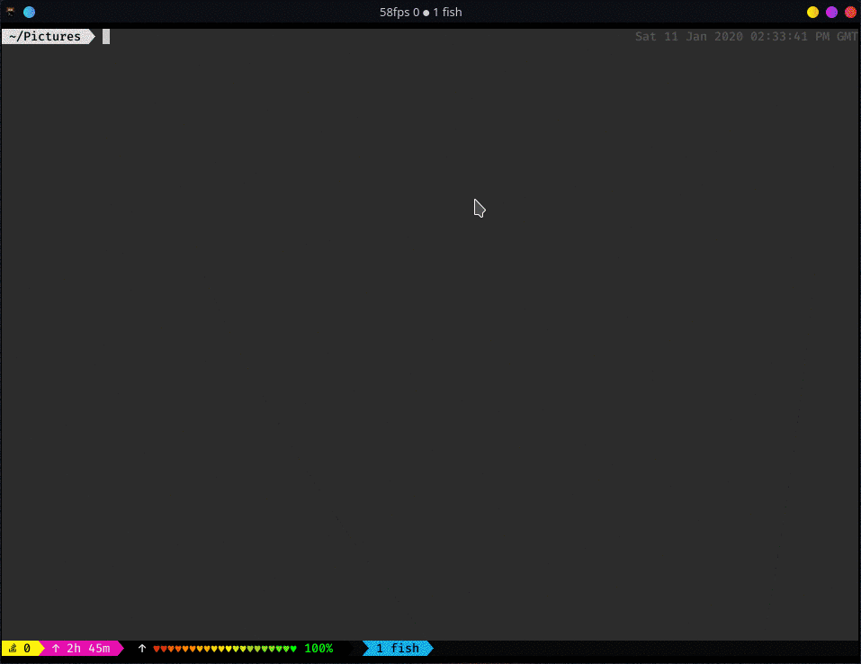

# viu

- [viu](#viu)
  - [Description](#description)
  - [Features:](#features)
  - [Installation](#installation)
    - [From source (recommended)](#from-source-recommended)
    - [Binary](#binary)
    - [Wapm](#wapm)
    - [Packages](#packages)
      - [Arch Linux](#arch-linux)
      - [NetBSD](#netbsd)
  - [Usage](#usage)
    - [Aspect Ratio](#aspect-ratio)
    - [Command line options](#command-line-options)

## Description
A small command-line application to view images from the terminal written in Rust. It is basically the
front-end of [`viuer`](https://github.com/atanunq/viuer). It uses either [iTerm](https://iterm2.com/documentation-images.html)
or [Kitty](https://sw.kovidgoyal.net/kitty/graphics-protocol.html) graphics protocol, if supported.
If not, lower half blocks (▄ or \u2584) are displayed instead.

Based on the value of `$TERM`, `viuer` decides which protocol to use. For half
blocks, `$COLORTERM` is inspected. If it contains either `truecolor` or `24bit`,
truecolor (16 million colors) will be used. If not, it will fallback to using only ansi256. A nice
explanation can be found in this [gist](https://gist.github.com/XVilka/8346728).


## Features:
- Native iTerm and Kitty support
- Animated GIF support
- Accept media through stdin
- Custom dimensions
- Transparency

## Installation

### From source (recommended)

Installation from source requires a local [Rust environment](https://www.rust-lang.org/tools/install).
Please note that at least Rust 1.39 is required.

```bash
git clone https://github.com/atanunq/viu.git

# Build & Install
cd viu/
cargo install --path .

# Use
viu img/giphy.gif
```
Or without cloning:
```bash
cargo install viu
```
<!--
##### [WASI](https://github.com/wasmerio/wasmer)
First, you will need the WASI target installed in your Rust system:

```bash
rustup target add wasm32-wasi --toolchain nightly
```

Once WASI is available, you can build the WebAssembly binary by yourself with:

```bash
cargo +nightly build --release --target wasm32-wasi
```

This will create a new file located at `target/wasm32-wasi/release/viu.wasm`.

When the wasm file is created you can upload it to wapm or execute it with wasmer:

```bash
wapm publish
# OR
wasmer run  target/wasm32-wasi/release/viu.wasm --dir=. -- img/giphy.gif
```
-->
### Binary
A precompiled binary can be downloaded from the [release
page](https://www.github.com/atanunq/viu/releases/latest).

### Wapm

Viu can be installed in Linux, macOS and Windows using [wapm](https://wapm.io/):

```bash
wapm install -g viu
```

### Packages

#### Arch Linux
There is an [AUR package available for Arch Linux](https://aur.archlinux.org/packages/viu/).

#### NetBSD
Available in [`graphics/viu`](http://cdn.netbsd.org/pub/pkgsrc/current/pkgsrc/graphics/viu/README.html).

## Usage
On a [Kitty](https://github.com/kovidgoyal/kitty) terminal:


On a Mac with iTerm:


Using half blocks (Kitty protocol and `tmux` do not get along):





Ctrl-C was pressed to stop the GIFs.


When `viu` receives only one file and it is GIF, it will be displayed over and over until Ctrl-C is
pressed. However, when couple of files are up for display (second example) the GIF will be displayed
only once.

### Aspect Ratio
If no flags are supplied to `viu` it will try to get the size of the terminal where it was invoked.
If it succeeds it will fit the image and preserve the aspect ratio. The aspect ratio will be changed
only if both options **-w** and **-h** are used together.

### Command line options
```
USAGE:
    viu [FLAGS] [OPTIONS] [FILE]...
    When FILE is -, read standard input.

FLAGS:
    -m, --mirror         Display a mirror of the original image
    -n, --name           Output the name of the file before displaying
    -1, --once           Only loop once through the animation
    -r, --recursive      Recurse down directories if passed one
    -s, --static         Show only first frame of gif
    -t, --transparent    Display transparent image with transparent background
    -v, --verbose        Output what is going on

OPTIONS:
    -f, --frame-rate <frames-per-second>    Play gif at the given frame rate
    -h, --height <height>    Resize the image to a provided height
    -w, --width <width>      Resize the image to a provided width

ARGS:
    <FILE>...    The image to be displayed
```
